# Project TODO List
|#|Task|Completed ?|Comments|
|---|---|---|---|
|1|Writing SMBus driver for BMS|<b><span style="color: green">&check;</span></b>| |
|2|Testing the code before push|<b><span style="color: green">&check;</span></b> |
|3|Push the SMBus driver for BMS to the public|<b><span style="color: green">&check;</span></b> |
|4|Documenting my work on GitHub|<b><span style="color: green">&check;</span></b>|
|5|Integrating BQ24725 Smart Charger|<b><span style="color: red">✗</span></b>|

# TIVAC_TM4C123G_SMBUS_BMS_INTERFACING

In this repository, I will talk about how I got any [Smart Battery Data Specification (SBS)](http://sbs-forum.org/specs/sbdat110.pdf) compliant laptop batteries working with [TIVAC TM4C123G LaunchPad™](https://www.ti.com/tool/EK-TM4C123GXL), also I will talk about how to configure the project to work fine with you.

<p align="center">
  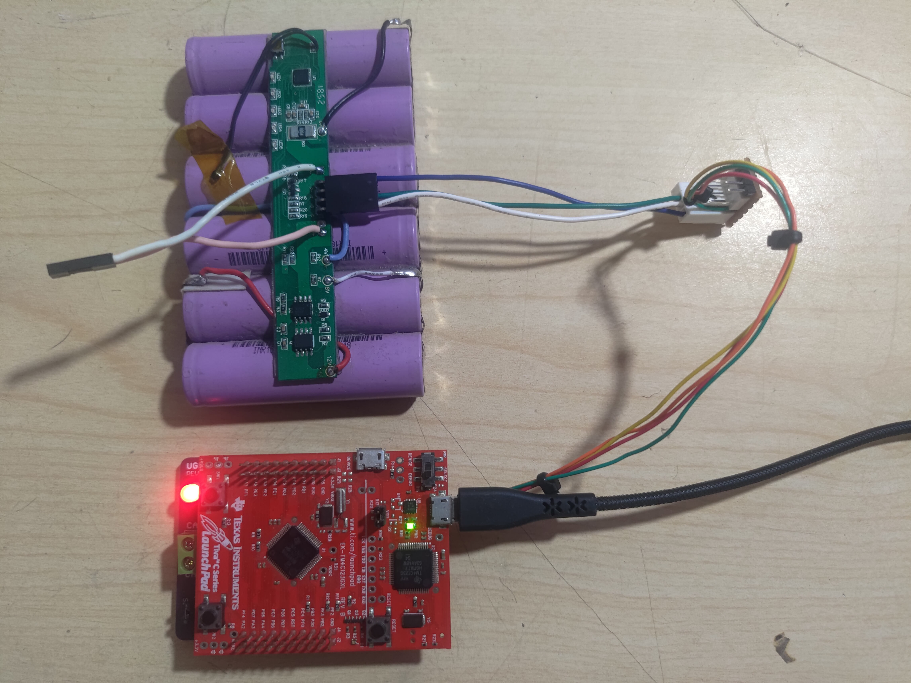
</p>

# Sponsors
I want to thank [Texas Instruments](https://www.ti.com/) for supporting me.
They supported me with these kits:
* [EV2400](https://www.ti.com/tool/EV2400?keyMatch=EV2400). This kit is a USB-based PC Interface Board for battery management systems. It has extensive software that controls the BMS, and it will help you configure your BMS. This tool is really helpful if you want to recycle the laptop BMSs.
* [BQ24725AEVM-710](https://www.ti.com/tool/BQ24725AEVM-710). This is a smart Lithium battery charger that could be controlled using the BMS (the BMS tells the smart charger the value of the charging voltage and current). I will talk about the BQ24725 later.

Now we have some serious work to do. :D
# Special Thanks

I want to thank all my close friends:
* I want to thank [Osama Ragab Mazidi](https://www.linkedin.com/in/osama-mazid-111540b5/) for his kindness and his continuous support. Without him, I couldn't have done anything.
* [Ahmed Osama](https://www.linkedin.com/in/eng1992/).

* Dr. Mohamed El-Dakroury.

for their support and help.
# Why I am doing this work ?
I noticed that many lithium battery recyclers throw the BMS boards in the garbage, although they are important and could be recycled also. I have noticed that you will find little information about how to reuse the laptop BMS on the internet (because it needs experience, and it could bring lots of money !), so I am doing this to encourage the community to share their experience and help each other. This repository is the result of studying the laptop BMS for 2 years.

# Introduction
The BMS is an electronic system that manages a rechargeble battery (cell or battery pack), such as by protecting the battery and monitoring its state, balancing each individual cell, and making sure that it operates within the safe operating area.

```
01- Reports the appropriate charging current needed for constant current charging and the appropriate charging voltage needed for constant voltage charging to a smart charger using SMBus broadcasts. These values can be sent to the BQ24725 smart charger.
02- Determines the chemical state of charge of each battery cell using Impedance Track™ and can reduce the charge difference of the battery cells in fully charged state of the battery pack gradually using cell balancing algorithm during charging. This prevents fully charged cells from overcharging and causing excessive degradation and also increases the usable pack energy by preventing premature charge termination.
03- Supports pre-charging/zero-volt charging.
04- Support fast charging.
05- Supports charge inhibit and charge suspend if battery pack temperature is out of temperature range.
06- Reports charging fault and also indicate charge status via charge and discharge alarms.
```

The BMS might also have a communication protocol that enables controlling it using any embedded system. The embedded system could also read many internal registers inside the BMS, such as:

```
01- The voltage for each individual cell.
02- The voltage of the pattery pack
03- The current (Positive value for charging, Negative for discharging, and zero for idle).
04- The temperature of the battery pack.
05- Estimated time to full (when charging).
06- Estimated Time to empty (when discharging).
07- Full charge capacity.
08- Remaining capacity.
09- Cycle count.
10- Absolute/Relative state of charge.
11- Charging voltage.
12- Charging current.
14- Battery status flags.
15- Mosfets status.
16- Charging status.

and more ....
```

The Laptop BMS is controlled using the System Management Bus (SMBus) protocol. It is a special type of I²C bus with a low frequency speed of 10KHz and might require a low value pull-up resistor such as 1.2 KOhm for both the clock and data lines. This protocol is used by all the computers to control the BMS and to read its basic information. This communication bus follows a standard which will be discussed further later.


We can do lots of projects using the BMS such as:
```
01- DIY power walls (using lithium batteries for storing solar energy) and monitoring each battery pack.
02- DIY electric scooters.
03- DIY electric cars and robots.
04- Battery backuped devices, power banks, and UPSs.
05- DIY power bank for Raspberry Pi and controlling it from Raspberry Pi.

So many applications ..
```

Once the battery is used too many times, its life degrades by usage, and once the BMS detects that one of the cells is damaged, it locks down the battery and prevents any further charging/discharging process.


## Standards to follow
There is good news. All the batteries connected to the laptop should follow some standards, such as:
* SMBus specifications version 1.1, kindly see [System Management Bus (SMBus) Specification, version 1.1.](http://smbus.org/specs/smbus110.pdf) for more details. This standard clarifies  all the requirements for the SMBus protocol.
* Smart Battery Data Specifications (SBS), kindly see [Smart Battery Data Specification](http://sbs-forum.org/specs/sbdat110.pdf) for more details.

<b><span style="color: green">Both of the two PDF files that are mentioned above here are adequate for our work, and any laptop BMS should work with us fine.</span></b>


# Disclaimer

<b><span style="color: red">Warning:</span></b>
Laptop batteries are so dangerous because they contain high energy and could explode if you make any mistake with them. It could even damage any device that is connected to it. I am not responsible for any damage or injuries that occur to anyone. Don't try this at home. <b><span style="color: red">You are doing this at your own risk</span></b>.

# Safety First!!
When working with lithium batteries, you must keep them in a clean environment (keep the batteries away from any metal objects). Keep the batteries in well-protected boxes; keep them far from any liquids; use proper safety tools for handling and containing lithium fires; keep the batteries far from children; and use proper tools for protecting your own computer, such as:

1- Using [USB isolators](https://www.adafruit.com/product/2107) for isolating the computer from the microcontroller that connected to the battery. If the high-voltage wires touch any signal wires, this could fry your computer and everything connected with it.

2- Make sure to fasten all your wires and keeping them intact.

3- Keep the communication wires away from the high-voltage wires.

# Getting Started
A while a go, I have started tinkering with an old BQ20z70 BMs (recycled from old laptop battery) and it was my lucky day that the BMS was locked using the default security key from TI, here is my experiment [Reverse Engineering BQ20z70 Laptop BMS](https://github.com/omarKmekkawy/Reverse_Engineering_BQ20z70_Laptop_BMS) and I have talked about [Understanding the BQ20z70 Security](https://github.com/omarKmekkawy/Reverse_Engineering_BQ20z70_Laptop_BMS/tree/main/Security) and how the authentication works. Finally, I have resetted the permanent failure flags and the BMS has another life.

<b><span style="color: green">This repository assumes that you have a working laptop battery with no permanent failure flags.</span></b>

I am currently using a recycled laptop battery with BQ4050. Any working BMS will work.

# Why Using TIVAC TM4C123G LaunchPad™ ?

<p align="center">
  
</p>

The real reason for using TIVAC is that Texas Instruments has the best support for the SMBus and they have integrated the SMBus drivers into the [TivaWare™ for C Series](https://www.ti.com/tool/SW-TM4C) SDK. Here is the example that I have used in my code [TM4C123GH6PM: Interface Tiva C to BQ78350R1 using SMbus over I2C](https://e2e.ti.com/support/microcontrollers/arm-based-microcontrollers-group/arm-based-microcontrollers/f/arm-based-microcontrollers-forum/766769/tm4c123gh6pm-smbus?tisearch=e2e-sitesearch&keymatch=smbus%20TivaC#). Also, they make awesome battery management systems kits and tools.

Also, the TIVAC TM4C123G LaunchPad™ is affordable, found everywhere in our country, and used a lot with students, which makes it the preferred kit.
# The Hardware Connection

<p align="center">
  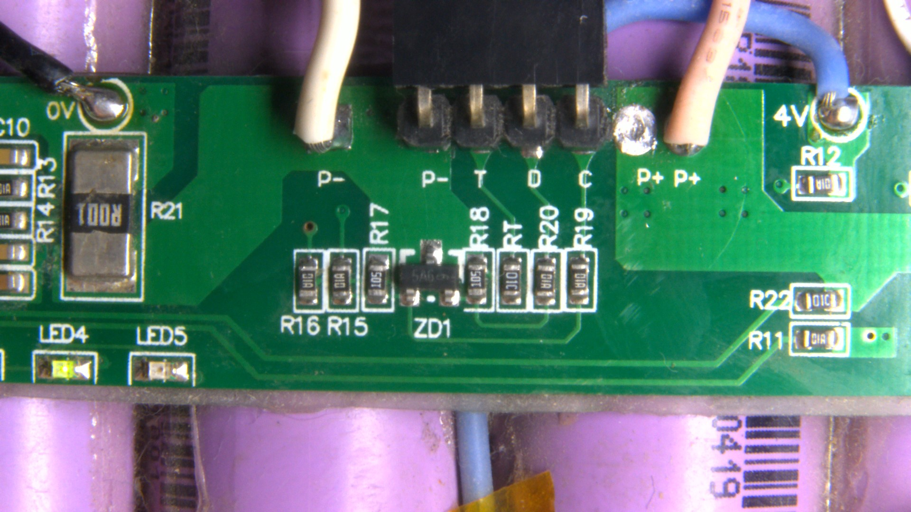
</p>

This image shows the connections of the BMS. I have soldered a pin header to help me with experimenting. The connections are illustrated in the following table:

| BMS Board  | Explanation  |
| ------------- | ------------- |
| P+  | Pack's positive pin <b><span style="color: red">(High Voltage - High Current) 11.1V nominal voltage </span></b>, this pin can be used for charging/discharging the battery pack|
| P+  | Pack's positive pin <b><span style="color: red">(High Voltage - High Current) 11.1V nominal voltage </span></b>, this pin can be used for charging/discharging the battery pack |
| C  | SMBus-Clock (Communication)  |
| D  | SMBus-Data  (Communication)|
| T  | This pin should be connected to the thermistor with a label (RT) which is integrated into the battery (it enables the laptop to measure the internal temperature of the battery pack). The Chinese manufacturer connected a fixed 10KOhm resistor :D !!!! |
| P-  | Pack's negative pin, which is shared with the communication protocol device and the load |
| P-  | Pack's negative pin, which is shared with the communication protocol device and the load |


## Connection Diagram
Here is the connection diagram for the BMS:

| BMS Board  | TIVAC TM4C123G LaunchPad™  |
| ------------- | ------------- |
| P+  | Not Connected |
| P+  | Not Connected |
| C  | PB2 |
| D  | PB3 |
| T  | Not Connected |
| P-  | Connected To GND |
| P-  | Not Connected  |

Here is how the BMS is interfaced with the TIVAC:
<p align="center">
  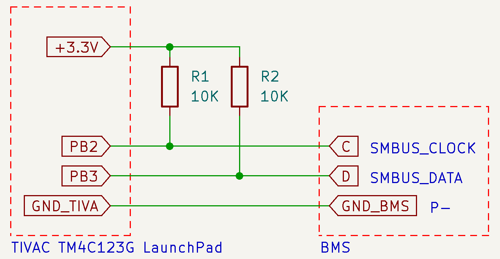
</p>

The R1, R2 are pull-up resistors for the SMBus protocol. The 3.3V supply is used for the SMBus pull up resistors.

### Implementation of the connections
Here are images for the connection implementation:

I bought a [MCP2551 CAN-BUS Shield For TIVA-C TM4C123 ARM Board](https://uge-one.com/mcp2551-can-bus-shield-for-tiva-c-tm4c123-arm-board.html) shield and used it for my connections. Here is a top view image:

<p align="center">
  
</p>
Bottom view image:
<p align="center">
  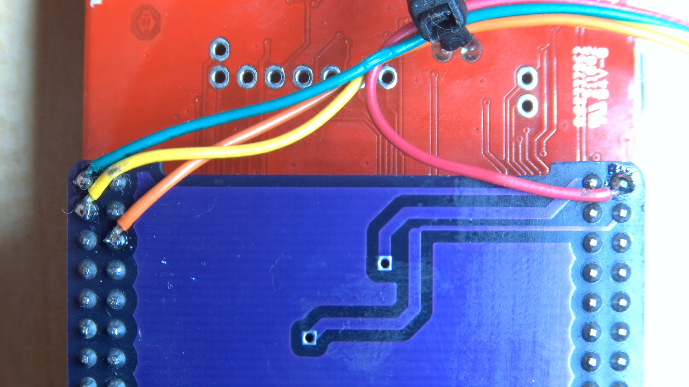
</p>

| Wire Color  | Function  | Connection with BMS |
| ------------- | ------------- | ------------- |
| Red  | 3.3V | None |
| Yellow  | PB2 (SMBus Clock) | C |
| Orange  | PB3 (SMBus Data) | D |
| Green  | GND (P-) | P- |

The Junction PCB:

Top view:

<p align="center">
  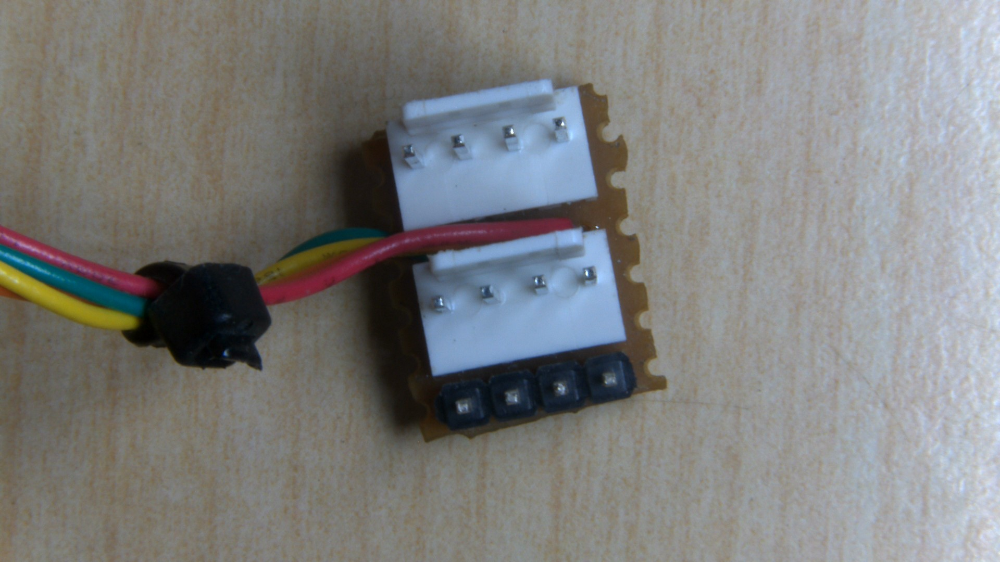
</p>


This PCB has 3 sockets:

* 2 X [KF2510 2.54 mm connector 4 Pins](https://www.aliexpress.com/item/32782704195.html). One of these connectors used for connecting BMS with the TIVAC. there is also another one used for connecting [EV2300](https://www.google.com/search?q=ev2300) or [EV2400](https://www.ti.com/tool/EV2400?keyMatch=EV2400) kit with both of the BMS and the TIVAC, the EV2300 and EV2400 are used for further debugging using the [Battery Management Studio](https://www.ti.com/tool/BQSTUDIO) software.

* 1 X 4 Pins 2.54mm male pin header. This connector used for connecting the [Logic Analyzer](https://uge-one.com/usb-logic-analyzer-8-channel-24mhz.html) with the SMBus for more further debugging (This is optional).

Bottom view:
<p align="center">
  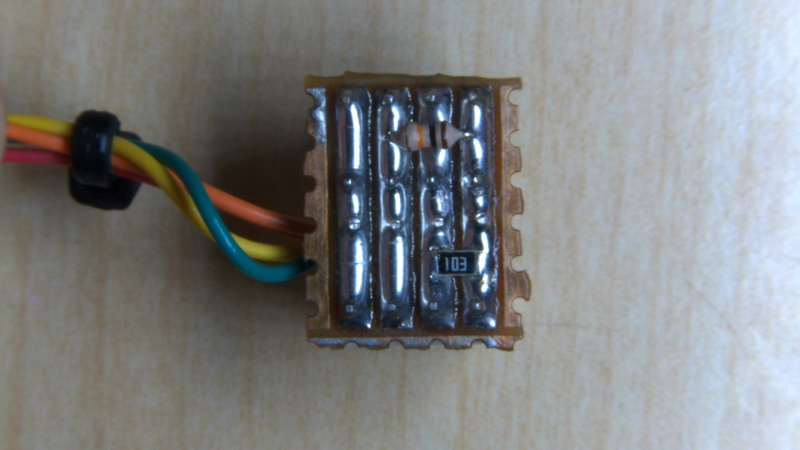
</p>
The image shows the two pull up resistors (10KOhm).

### Connecting the BMS with the junction PCB
The image down below shows the connectors for the BMS:
<p align="center">
  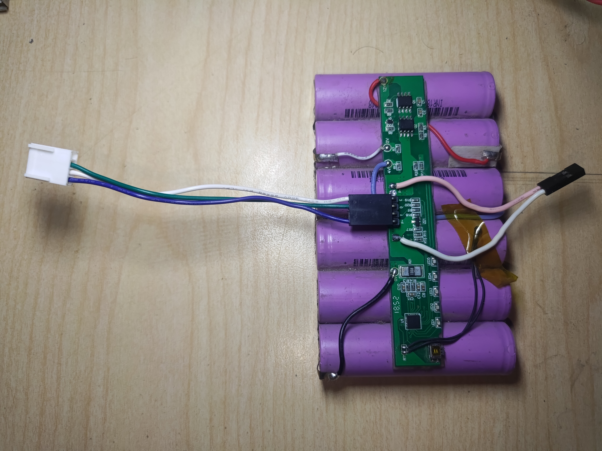
</p>

Connecting the BMS with TIVAC:

<p align="center">
  
</p>

 Adding Logic Analyzer (Optional) for further SMBus debugging:
 <p align="center">
  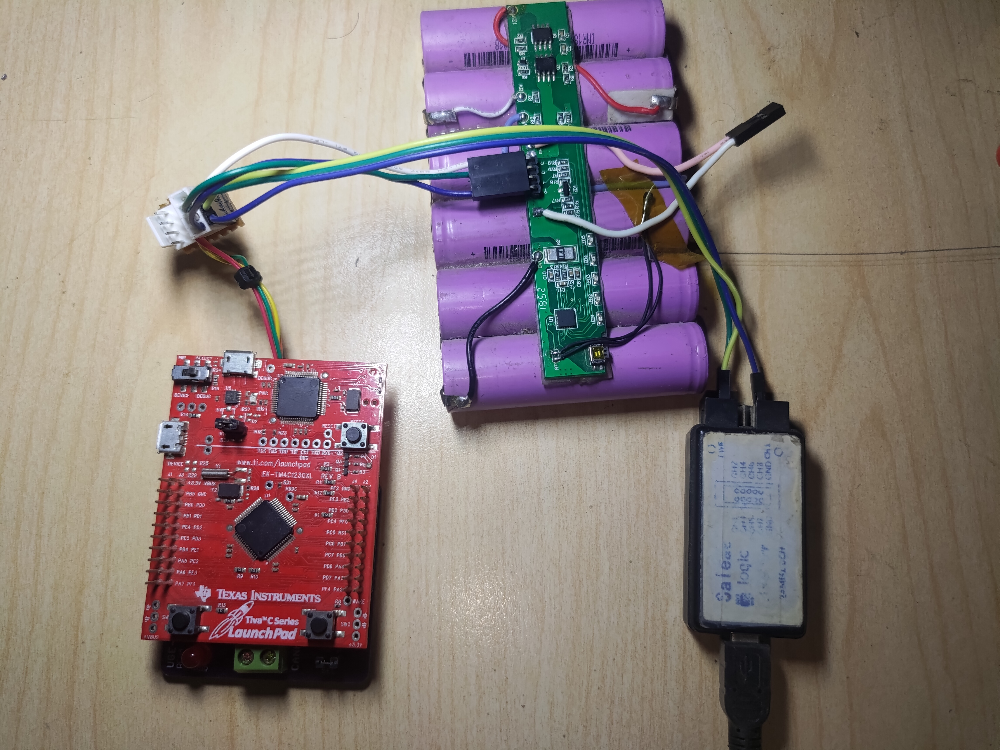
</p>

Logic Analyzer Connection with SMBus:
| Logic Analyzer Wire Color  | Function  | Connection with SMBus |
| ------------- | ------------- | ------------- |
| Yellow  | Channel 0 | SMBus Clock |
| Green  | Channel 1 | SMBus Data |
| Blue  | GND (P-) | P- |

Adding EV2300 or EV2400 for comparing both the rests from TIVAC and Battery Management Studio:
 <p align="center">
  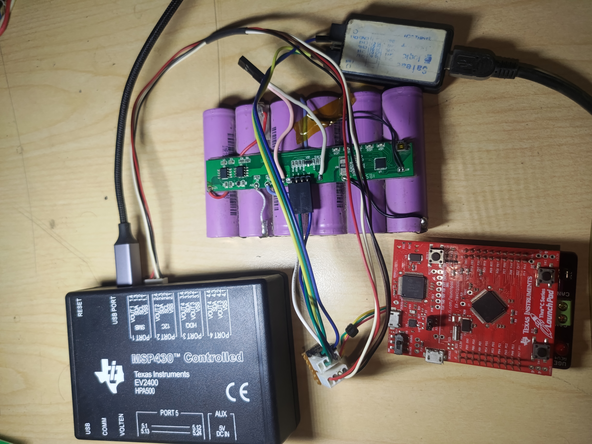
</p>

### Isolate Everything

You need to use USB isolator for anything connected to the USB, I have used my own one, but you can use [USB isolators](https://www.adafruit.com/product/2107) from Adafruit.

 <p align="center">
  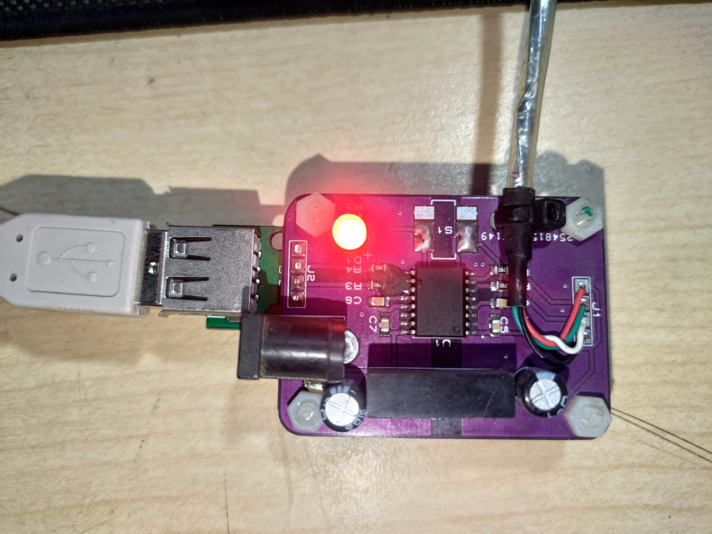
</p>

I have used one USB isolator for each one of the following USB interfaces:
* Logic Analyzer.
* TivaC.
* EV2400.

 <p align="center">
  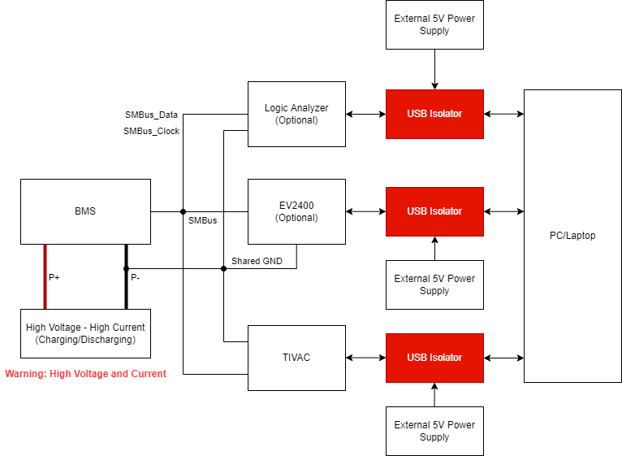
</p>

Now the connection is ready.

# Configuring The TIVAC Firmware
Here in this folder [TIVAC_SMBUS_BMS](TIVAC_SMBUS_BMS), you will find the TIVAC firmware for the BMS.

You will need to install the following prerequisites:
* [TivaWare™ for C Series](https://www.ti.com/tool/SW-TM4C)
* [Code Composer Studio 12.0.0](https://www.ti.com/tool/download/CCSTUDIO/12.0.0).

This video will help you:
* [How to Download & Install Code Composer Studio| CCS Blink Led TM4C123GH6PM](https://www.youtube.com/watch?v=fJrFksbSkJU).

In order to link the project with the TIVAWare, you will need to do the following steps:
* How to Add TivaWare to an Existing CCS Project, see pages from 23 to 27 in this file [Getting Started with TivaWare™ for
C Series](https://www.ti.com/lit/ug/spmu373/spmu373.pdf?ts=1659452474436).

If you done the steps right, the project settings should look like this:

<p align="center">
  
</p>

<p align="center">
  
</p>

<p align="center">
  
</p>

<p align="center">
  
</p>

<p align="center">
  
</p>

### Linking files

You will need to add the smbus.c file to the project, this file will be found in the path "C:\ti\TivaWare_C_Series-2.0\utils\smbus.c". Follow the steps here:
* Linking Files and Libraries into a TivaWare Project
in Code Composer Studio, see pages from 13 to 17 in this file [Getting Started with TivaWare™ for
C Series](https://www.ti.com/lit/ug/spmu373/spmu373.pdf?ts=1659452474436).

After this steps, you are ready to test the firmware with the BMS.


# Testing the firmware with BQ4050 BMS
After connecting the TIVAC, a USB to serial device will show in the device manager:

<p align="center">
  
</p>
The COM3 is a serial channel that connects the microcontroller to the PC through the debugger. We will use this serial port to print the data from the BMS.

## Results for the BQ4050

<p align="center">
  
</p>

After connecting the serial terminal with the COM3, we will see the output from the TIVAC.
<p align="center">
  
</p>

```
BQ4050 SBS Commands Example 
Manufacturer Access: 0x7181 
Remaining Capacity Alarm: 300 mAh
Battery Mode: 0x4101 
At Rate: 0 mA 
At Rate Time To Full: 65535 minute(s) 
At Rate Time To Empty: 65535 minute(s) 
At Rate OK: 1 
Temperature: 33 Degree C 
Voltage: 12507 mV 
Current: 0 mA 
Average Current: 0 mA 
Max Error: 100 % 
Relative State Of Charge: 81 % 
Absolute State Of Charge: 76 % 
Remaining Capacity: 3342 mAh 
Full Charge Capacity: 4144 mAh 
Run Time To Empty: 65535 min 
Average Time To Empty: 65535 min 
Average Time To Full: 65535 min 
Battery Status: 0x48c0 
Cycle Count: 0 
Design Capacity: 4400 mAh 
Design Voltage: 11100 mV 
Manufacture Date: 21\03\2019
Serial Number: 0x0001
```

Comparing the result with the data from Battery Management Studio:
<p align="center">
  
</p>

We will see that the data matches with the Battery Management Studio.

## Results for the BQ30z55

<p align="center">
  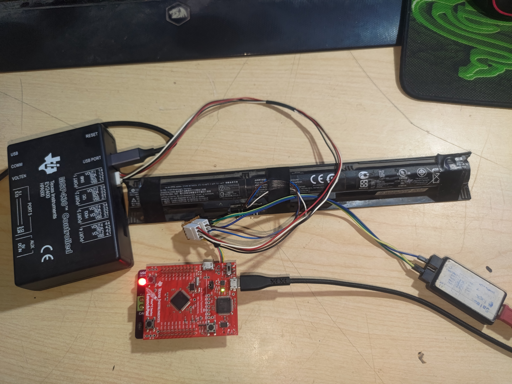
</p>

After connecting the serial terminal with the COM3, we will see the output from the TIVAC.
<p align="center">
  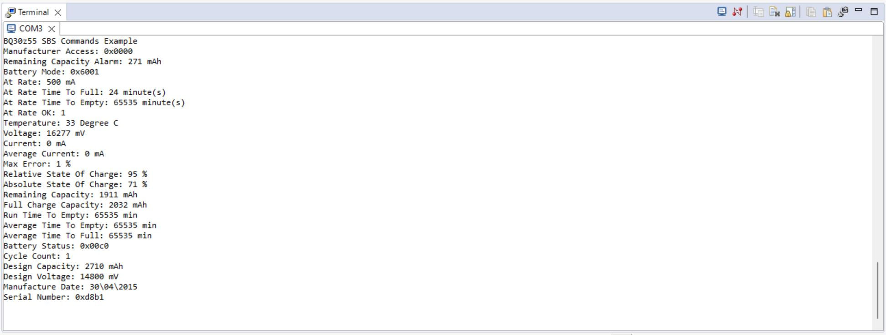
</p>

```
BQ30z55 SBS Commands Example 
Manufacturer Access: 0x0000 
Remaining Capacity Alarm: 271 mAh
Battery Mode: 0x6001 
At Rate: 500 mA 
At Rate Time To Full: 24 minute(s) 
At Rate Time To Empty: 65535 minute(s) 
At Rate OK: 1 
Temperature: 33 Degree C 
Voltage: 16277 mV 
Current: 0 mA 
Average Current: 0 mA 
Max Error: 1 % 
Relative State Of Charge: 95 % 
Absolute State Of Charge: 71 % 
Remaining Capacity: 1911 mAh 
Full Charge Capacity: 2032 mAh 
Run Time To Empty: 65535 min 
Average Time To Empty: 65535 min 
Average Time To Full: 65535 min 
Battery Status: 0x00c0 
Cycle Count: 1 
Design Capacity: 2710 mAh 
Design Voltage: 14800 mV 
Manufacture Date: 30\04\2015
Serial Number: 0xd8b1  
```

Comparing the result with the data from Battery Management Studio:

Flags:
<p align="center">
  
</p>

Static Data:

<p align="center">
  
</p>

We will see that the data matches with the Battery Management Studio.

# Useful Links
* [SMBus Compatibility With an I²C Device](https://www.ti.com/lit/an/sloa132/sloa132.pdf).
* [Implementing SMBus Using MSP430™ Hardware I²C](https://www.ti.com/lit/an/slaa249b/slaa249b.pdf).
* [Enhanced I²C and SMBus Master Interface Reference Design With PRU-ICSS](https://www.ti.com/lit/ug/tiduby1a/tiduby1a.pdf).
* [Understanding the I²C Bus](https://www.ti.com/lit/an/slva704/slva704.pdf).
* [SMBus Made Simple](https://www.ti.com/lit/an/slua475/slua475.pdf).
* [BQ2085: Firmware help for Smbus](https://e2e.ti.com/support/power-management-group/power-management/f/power-management-forum/1096074/bq2085-firmware-help-for-smbus).
* [TM4C123GH6PM: Does the TM4C123G microcontroller have pre-written library for Smart Battery API](https://e2e.ti.com/support/microcontrollers/arm-based-microcontrollers-group/arm-based-microcontrollers/f/arm-based-microcontrollers-forum/692547/tm4c123gh6pm-does-the-tm4c123g-microcontroller-have-pre-written-library-for-smart-battery-api?tisearch=e2e-sitesearch).
* [TM4C123GH6PM: Interface Tiva C to BQ78350R1 using SMbus over I2C](https://e2e.ti.com/support/microcontrollers/arm-based-microcontrollers-group/arm-based-microcontrollers/f/arm-based-microcontrollers-forum/766769/tm4c123gh6pm-smbus?tisearch=e2e-sitesearch&keymatch=smbus%20TivaC#)

# Future Work

<p align="center">
  
</p>

* Interfacing BQ24725 smart charger with TM4C123G.

* Controlling both of the BMS and BQ24725 with CAN Bus.

* Making a battery pack with more than one BMS connected together and controlling the battery pack using CAN BUS.

# Notes
This repository required a lot of work in many fields:
* Hardware reverse engineering.
* Battery management systems.
* Embedded Systems.
* Communication Protocols Reverse Engineering.
* Security.
* Soldering.
So, please consider that my work might not be perfect. This work could be done with a whole team and took around 2 years of non-continuous work by myself only.

This repository needs a lot of work in order to get better code that works efficiently with no mistakes, and this will require lots of testing and maintaining the code.

# Contribution
All contributions are available to anyone who wants to make this work better. Thank you all for your support.

# Support Me
If you have seen my work and it helped you, please support me on LinkedIn by endorsing my skills. It will be appreciated :grinning:.

<p>
  <a href="https://www.linkedin.com/in/omar-mekkawy/" rel="nofollow noreferrer">
    
  </a> &nbsp;
</p>

# Donate to My Work
It would be a pleasure if you supported me on any of the following platforms; it will help finish this work and getting new tools.
* [Buy Me A Cofee](https://www.buymeacoffee.com/omarmekkawy).
* You can visit my [Patreon](https://www.patreon.com/OmarMekkawy) page and become a Patreon.
* You can do a one-time donation via PayPal at [Donate Using Paypal](https://www.paypal.me/OmarKhaledMekkawy).

Thank you for your support.